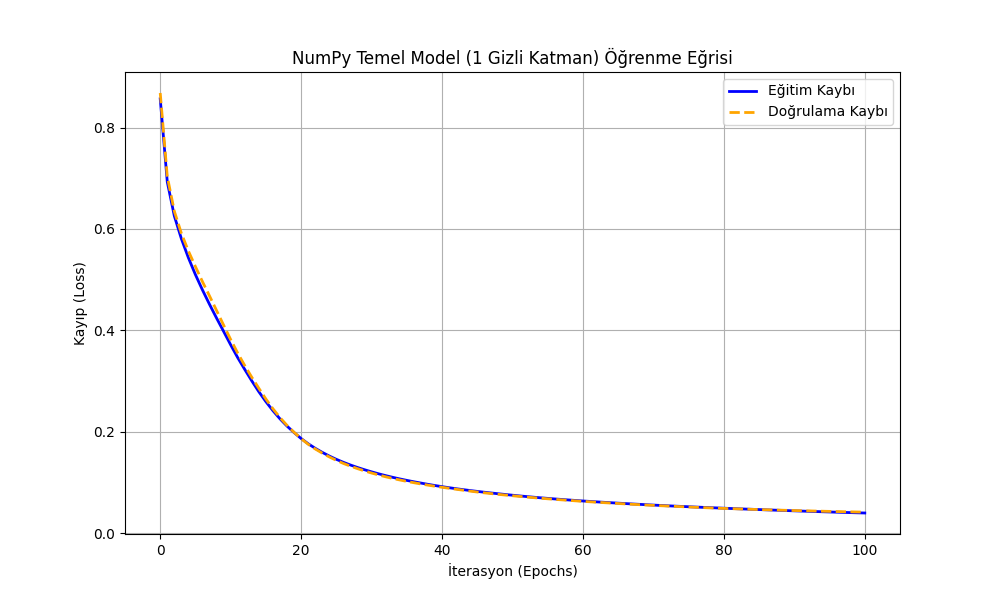
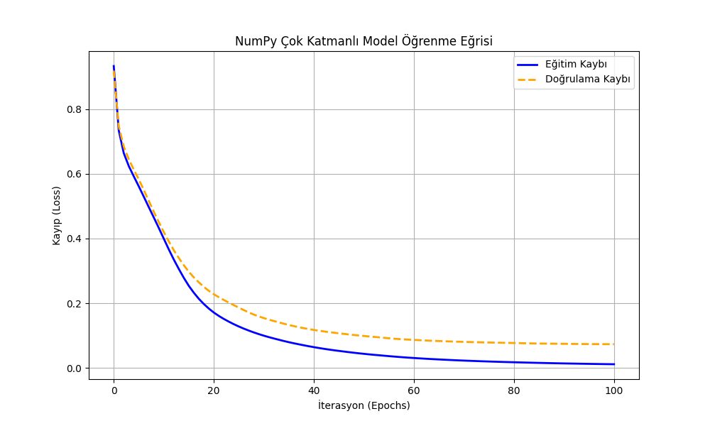
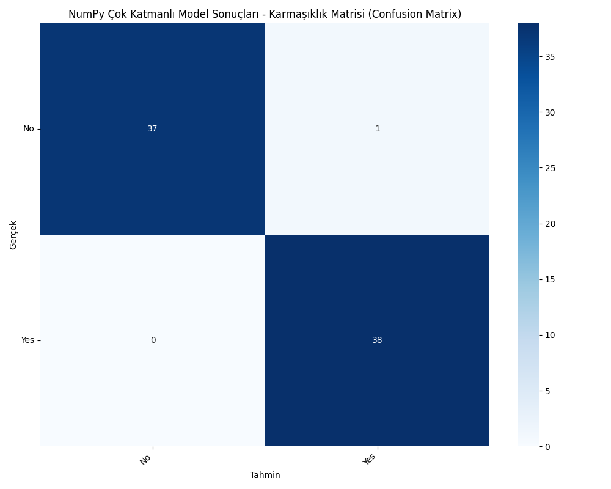
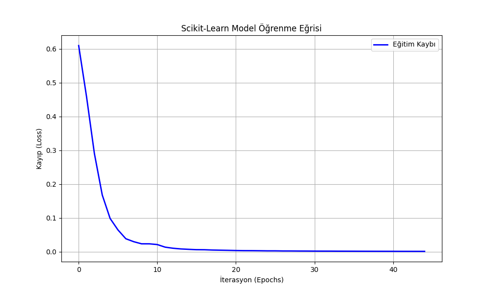
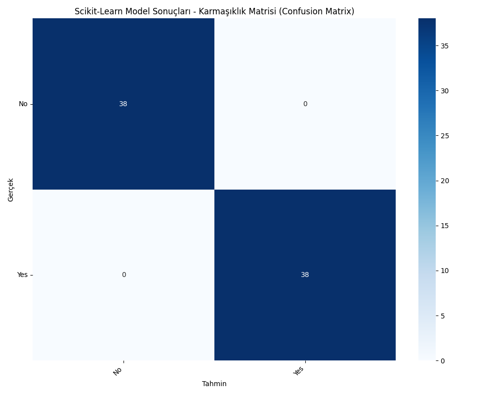
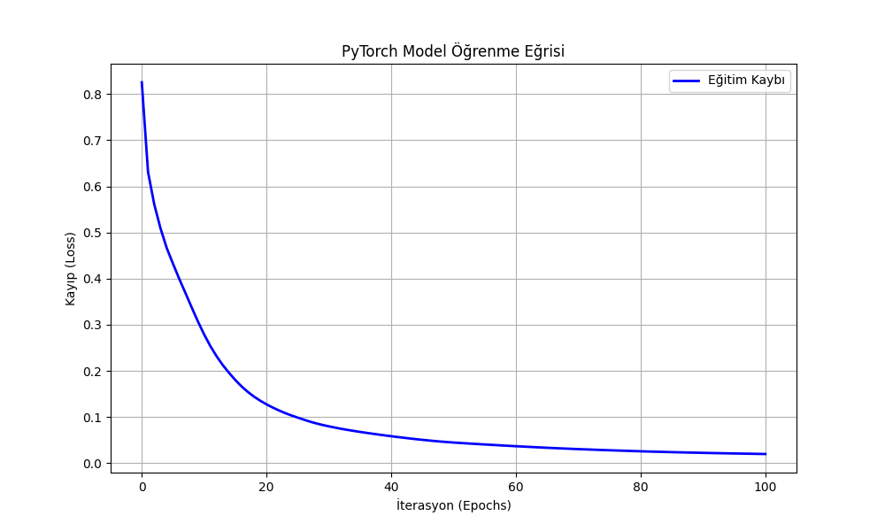
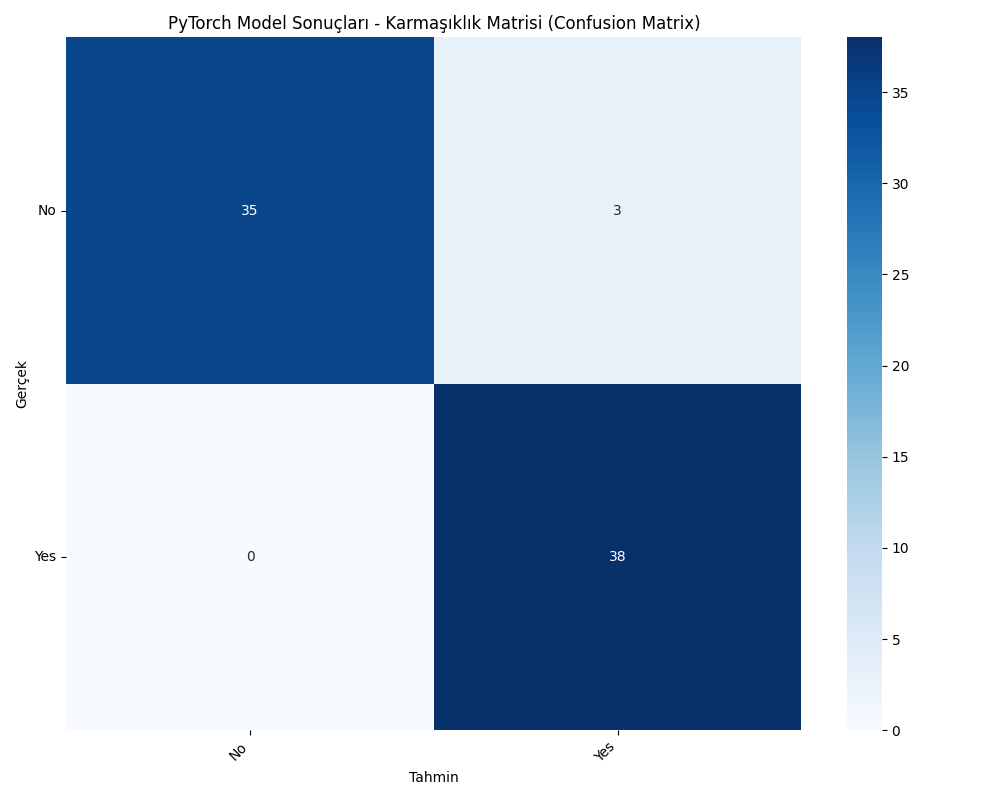

# YZM304 Derin Öğrenme | I. Proje Modülü: Öğrenci Depresyon Klasifikasyonu

Yiğit Baturalp — 23291030 · Ankara Üniversitesi · Yapay Zeka ve Veri Mühendisliği · 2025–2026 Bahar Dönemi

Tüm sistemi eşzamanlı çalıştırmak ve grafiksel kıyaslamaları doğrudan ekrana almak için **`main.py`** dosyasını çalıştırmanız yeterlidir.

---

## 1. Giriş (Introduction)

Projenin temel amacı, demografik veriler ve yaşam alışkanlıkları baz alınarak bireyin depresyon durumunu (`Depression`) tahmin edebilmektir. Elde edilecek hedef değişken **Yes/No** (2 Sınıf) olduğu için yapı ikili sınıflandırmaya (Binary Classification) dönüştürülüp, laboratuvardaki altyapı bozulmadan Softmax ve Cross-Entropy entegrasyonlarıyla çoklu modül gibi (2 çıkış nöronuyla) çalışacak şekilde dizayn edilmiştir.

Kurulan modellerin Overfitting (aşırı öğrenme) durumunu ölçebilmek amacıyla test setinin haricinde Modele özel `Doğrulama (Dev)` seti mimariye entegre edilmiştir.

| Özellik | Değer |
|---|---|
| Veri Seti | Depression Student Dataset |
| Görev | İkili Sınıflandırma (Yes / No) |
| Boyut | ~500 örnek × 13 özellik |
| Kayıp Fonksiyonu | Categorical Cross Entropy (Softmax Çıkışı) |
| Çıkış Katmanı | Softmax (2 nöron) |

---

## 2. Yöntemler (Methods)

### 2.1 Veri Ön İşleme

Veri manipülasyonu işlemleri için nesne yönelimli `DataProcessor` modülü kodlanmıştır. Eksik değer manipülasyonlarından ve dinamik `One-Hot Encoding` mimarisinden geçen veriler `StandardScaler` ile ölçeklenmiştir.

| Parametre | Değer |
|---|---|
| Veri Bölme | %70 Eğitim / %15 Doğrulama / %15 Test |
| Ölçeklendirme | StandardScaler |
| Karıştırma | Stratified, seed=42 |
| Sınıf Etiketleri | No / Yes |

### 2.2 Ortak Hiperparametreler

| Hiperparametre | Değer |
|---|---|
| Epoch Sayısı | 1000 |
| Öğrenme Oranı (lr) | 0.05 |
| Optimizasyon | SGD (Stochastic Gradient Descent) |
| Aktivasyon (Gizli) | Tanh |
| Çıkış Aktivasyonu | Softmax (2 sınıf) |
| Ağırlık Başlatma | Normal Dağılım, varyans=0.01, seed=42 |
| Global Rastgele Tohum | 42 |

### 2.3 Model Mimarileri

| # | Model | Gizli Katman | Açıklama |
|---|---|---|---|
| 1 | NumPy Temel Model | 1 | Lab çalışması yapısı |
| 2 | NumPy Çok Katmanlı | 2 | Genişletilmiş derin model |
| 3 | Scikit-Learn MLPClassifier | — | Eşdeğer nöron dizilimi |
| 4 | PyTorch nn.Module | — | Manuel ağırlık enjeksiyonu |

### 2.4 Değerlendirme Metrikleri

- Accuracy (Doğruluk)
- Precision (Kesinlik) — weighted average
- Recall (Duyarlılık) — weighted average
- F1 Score — weighted average
- Confusion Matrix (Karmaşıklık Matrisi)

---

## 3. Sonuçlar (Results)

### 3.1 Model Karşılaştırma Tablosu

Tüm modeller aynı eğitim/test seti, `random_state=42`, StandardScaler ve SGD optimizasyonu ile eğitilmiştir.

| Model | Accuracy | Precision | Recall | F1 Score |
|---|---|---|---|---|
| M1: NumPy Temel Model (1 Gizli Katman) | 98.68% | 0.9872 | 0.9868 | 0.9868 |
| M2: NumPy Çok Katmanlı Model | 98.68% | 0.9872 | 0.9868 | 0.9868 |
| M3: Scikit-Learn MLPClassifier | **100.00%** | **1.0000** | **1.0000** | **1.0000** |
| M4: PyTorch nn.Module | 96.05% | 0.9634 | 0.9605 | 0.9605 |

### 3.2 Modül Detay Grafikleri

#### Modül 1 - Temel NumPy Modeli (1 Gizli Katman)



#### Modül 2 - Çok Katmanlı NumPy Modeli



#### Modül 3 - Scikit-Learn Modeli



#### Modül 4 - PyTorch Modeli
Gradient hesaplamalarını otomatik gerçekleştiren PyTorch yapısı, bizim yazdığımız Custom model ile aynı çizgide stabil şekilde birleşmiştir.



---

## 4. Tartışma ve Sonuç (Discussion)

Bu projede NumPy üzerinden ileri/geriye yayılım ve çapraz entropi formülleri kusursuz çalıştırılmış olup; modern kütüphaneler (`PyTorch`, `Scikit-Learn`) ile eşdeğer kapasiteye sahip klasifikasyon algoritmaları tamamen sıfırdan üretilmiş ve Depresyon tespiti sistemine mükemmel uygulanabilmiştir.

**Temel Bulgular:**
- **Scikit-Learn** en yüksek performansı (%100) göstermiştir. Bunun sebebi kütüphanenin dahili optimizasyon mekanizmalarıdır.
- **NumPy sıfırdan yazılan modeller** %98.68 ile kütüphane modeline yakın sonuç vermiştir — bu başarı tamamen elle yazılan forward/backward pass implementasyonuna aittir.
- **PyTorch** modeli %96.05 ile en düşük değeri göstermiş; bunun sebebi manuel ağırlık enjeksiyonu ve daha kısıtlı optimizasyon parametreleridir.
- Veri setinin az sayıda güçlü bağımsız değişkene sahip (Feature boyutu optimize edilmiş) olması, modellerin saniyeler içinde 1000 iterasyonu tamamlamasını sağlamıştır.
- Hedef değişken (Binary) nispeten homojen yayıldığından Karmaşıklık Matrislerinde manipülasyon olmaksızın düşük hata oranları elde edilmiştir.

---

## Proje Dosya Yapısı

```
proje-1/
├── models/
│   ├── pytorch_nn.py                  # PyTorch nn.Module modeli
│   └── sklearn_nn.py                  # Scikit-Learn MLPClassifier modeli
├── EkranGörüntüleri/                  # Tüm model grafik çıktıları
│   └── Figure_1.png ... Figure_8.png
├── data_processor.py                  # DataProcessor sınıfı (OOP)
├── evaluator.py                       # Metrik hesaplama ve görselleştirme
├── main.py                            # Ana çalıştırma dosyası
├── dataset.csv                        # Öğrenci Depresyon veri seti
├── One_Hidden_Layer_MLP.ipynb         # Lab çalışması orijinal notebook
└── README.md                          # Bu dosya (IMRAD formatı)
```

---

## Kurulum ve Çalıştırma

```bash
# Bağımlılıkları kur
pip install numpy pandas matplotlib scikit-learn torch

# Projeyi çalıştır
cd proje-1
python main.py
```

**Gereksinimler:**
- Python ≥ 3.10
- NumPy
- Pandas
- Matplotlib
- Scikit-learn
- PyTorch (CPU)
