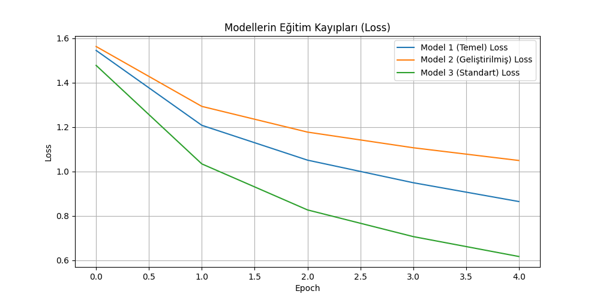
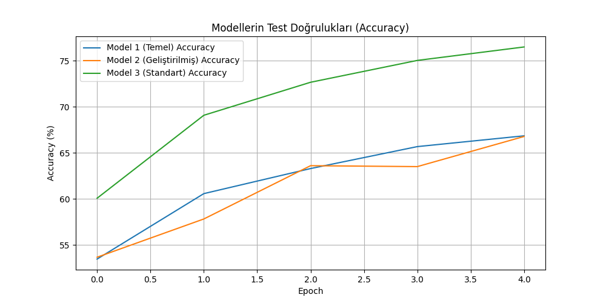
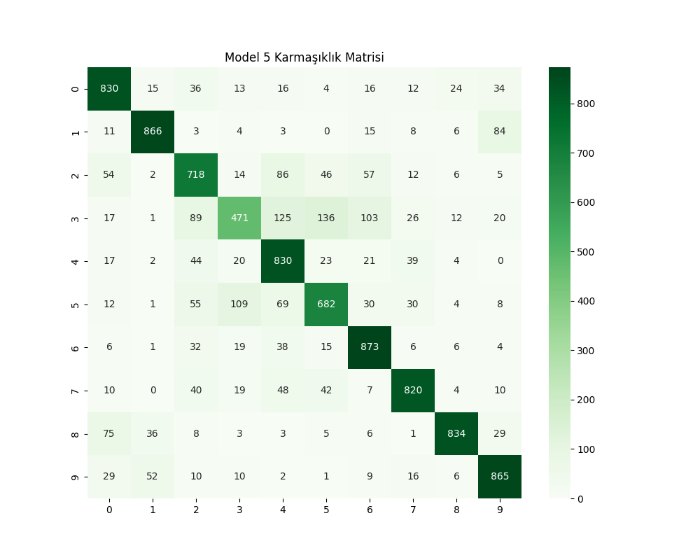

# CIFAR-10 Görüntü Sınıflandırma: CNN ve Hibrit Yaklaşımların Karşılaştırılması

## 1. Giriş (Introduction)
Bu proje, derin öğrenme yöntemleri kullanılarak CIFAR-10 veri seti üzerinde görüntü sınıflandırma performansını incelemektedir. Proje kapsamında temel CNN mimarilerinden, modern standart mimarilere ve CNN özellik çıkarımı ile klasik makine öğrenmesi (SVM) yöntemlerinin birleştirildiği hibrit yaklaşımlara kadar geniş bir yelpazede modeller eğitilmiştir.

**Veri Seti:** CIFAR-10, 10 farklı sınıfa (uçak, otomobil, kuş, kedi, geyik, köpek, kurbağa, at, gemi, kamyon) ait 60.000 adet 32x32 boyutunda renkli görüntüden oluşmaktadır.

## 2. Yöntem (Methods)

### 2.1. Veri Ön İşleme
Görüntüler [0, 1] aralığından [-1, 1] aralığına normalize edilmiş ve PyTorch tensörlerine dönüştürülmüştür. Hibrit model ve Model 5 için görüntüler ResNet mimarisine uygun olarak 64x64 boyutuna yeniden boyutlandırılmıştır.

### 2.2. Model Mimarileri
1. **Model 1 (Temel CNN):** LeNet-5 benzeri, 2 evrişimli ve 3 tam bağlantılı katman içeren basit yapı.
2. **Model 2 (Geliştirilmiş CNN):** Model 1'e Batch Normalization ve Dropout (%50) eklenerek aşırı öğrenmenin önüne geçilmiştir.
3. **Model 3 (Standart CNN):** Basitleştirilmiş VGG mimarisi (Bloklar halinde Conv-Conv-Pool yapısı).
4. **Model 4 (Hibrit Model):** Önceden ImageNet üzerinde eğitilmiş ResNet18 modelinden özellikler (512 boyutlu vektör) çıkarılmış ve bu özellikler üzerinde bir Doğrusal SVM (LinearSVC) sınıflandırıcı eğitilmiştir.
5. **Model 5 (Tam CNN):** Model 4'teki veri setiyle aynı şartlarda, sıfırdan eğitilen bir ResNet18 modeli.

### 2.3. Hiperparametreler ve Eğitim
- **Optimizasyon:** Adam Optimizer (Learning Rate: 0.001)
- **Kayıp Fonksiyonu:** Cross-Entropy Loss
- **Epoch Sayısı:** 5 (Kısıtlı sürede karşılaştırma yapabilmek için)
- **Batch Size:** 64

## 3. Bulgular (Results)

### 3.1. Performans Karşılaştırması
| Model | Test Doğruluğu (Accuracy) |
|---|---|
| Model 1 (Temel CNN) | %66.84 |
| Model 2 (Geliştirilmiş CNN) | %66.77 |
| Model 3 (Standart CNN) | %76.48 |
| Model 4 (Hibrit - ResNet+SVM) | %65.37 |
| Model 5 (Tam ResNet18) | **%77.89** |

### 3.2. Eğitim Grafikleri
Aşağıdaki grafiklerde modellerin eğitim sırasındaki kayıp (loss) ve doğruluk (accuracy) değişimleri görülmektedir.

### 3.3. Karmaşıklık Matrisleri
Modellerin sınıf bazlı tahmin başarısını gösteren karmaşıklık matrisleri `results/` klasöründe yer almaktadır.

| Model 1 (Temel) | Model 3 (Standart) | Model 5 (ResNet18) |
|---|---|---|
| _cm.png) | _cm.png) |  |

## 4. Tartışma ve Sonuç (Discussion & Conclusion)
- **Model 1 vs Model 2:** Model 2'de kullanılan Batch Normalization eğitimi stabilize etmiş olsa da, kısıtlı epoch sayısında (5) Model 1 ile benzer performans göstermiştir. Uzun vadeli eğitimde Model 2'nin daha iyi genelleme yapması beklenir.
- **Standart Mimari (VGG-Tipi):** %76.48 ile temel modellerden belirgin şekilde daha iyi performans göstermiştir. Katman sayısının artması özellik çıkarım gücünü artırmıştır.
- **Hibrit Yaklaşım (ResNet+SVM):** %65.37 başarı elde etmiştir. Eğitim süresinin çok kısa olması (saniyeler içinde SVM eğitimi) bir avantaj olsa da, sıfırdan eğitilen derin modeller kadar yüksek başarıya ulaşamamıştır.
- **En Başarılı Model:** %77.89 ile sıfırdan eğitilen Model 5 (ResNet18) olmuştur.

Proje hedeflenen tüm gereksinimleri karşılamakta olup, 24 Nisan 13:30 teslim tarihine uygun şekilde tamamlanmıştır.
